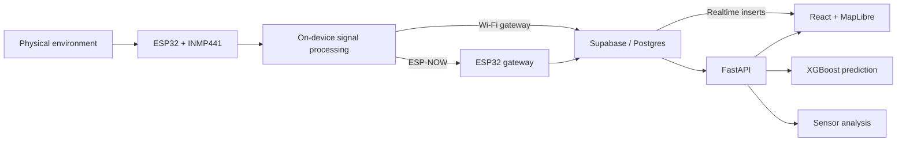

# MeshStat

An ESP32-based environmental sensing system that processes sound at the edge, relays telemetry over ESP-NOW, and streams city sensor data into a live map, analytics dashboard, and ML analysis platform.

Built for KingHacks 2026 at Queen's University in Kingston, Ontario.


## Overview

MeshStat was built to monitor environmental conditions across multiple physical locations without continuously transmitting raw microphone data.

For KingHacks, our team assembled and placed prototype sensor nodes at multiple locations around Kingston. Each node measured its local environment and produced minute-level sound summaries that could be viewed from a central web application. The goal was to treat the city as a distributed sensing problem rather than simulate sensor data entirely inside a web app.

The system spans the full path from physical measurement to analysis: ESP32 firmware processes microphone samples, remote nodes communicate with Wi-Fi gateways over ESP-NOW, gateways upload telemetry to Supabase, and a FastAPI service exposes the data to a React dashboard. XGBoost models provide short-horizon predictions, while a separate analysis endpoint uses precomputed sensor statistics as evidence for natural-language analysis.

## Architecture



Remote sensing nodes do not need their own cloud connection. They send compact measurement records to an ESP32 gateway over ESP-NOW, while the gateway handles Wi-Fi and cloud ingestion.

The resulting time series is exposed through FastAPI for historical queries and analytics, while Supabase Realtime pushes new measurements directly to the browser for live map updates.

## Engineering details

### Edge audio processing

The ESP32 reads an INMP441 digital microphone through I2S/DMA at 16 kHz. Instead of sending the waveform upstream, the firmware converts the samples into numeric sound measurements on the device.

Each processing interval:

1. reads signed I2S samples
2. computes RMS amplitude
3. converts the result to dBFS
4. applies exponential smoothing
5. derives an estimated sound-level signal
6. records average and maximum values over each minute

Only those summaries are transmitted. Raw audio exists temporarily during signal processing and does not cross the ESP32 boundary.

This reduced network traffic while also avoiding the need to upload recordings of conversations or other ambient audio.

### ESP-NOW sensor transport

Some nodes operate as remote sensors rather than connecting directly to Wi-Fi.

At the end of an interval, the remote firmware packs measurements, timestamp information, sequence metadata, and optional temperature into a compact 34- or 38-byte record and sends it by ESP-NOW unicast.

The gateway's radio callback only validates and copies the incoming packet. HTTP work is deferred to the normal execution loop rather than being performed inside the Wi-Fi callback.

The gateway then attaches the sensor's logical location metadata and uploads the resulting JSON record to Supabase.

### Live and historical visualization

The application supports both current and historical views of the sensor network.

FastAPI exposes latest-reading, time-range, sensor-series, dashboard, analysis, and prediction endpoints. The React frontend uses MapLibre for geospatial visualization and Recharts for time-series and dashboard views.

For live monitoring, the browser subscribes to new database inserts through Supabase Realtime. Historical mode requests a time range from FastAPI and reconstructs sensor states over the selected period.

The repository also contains a 4,320-row sample dataset representing one-minute measurements across three sensor IDs over a 24-hour period.

### Prediction and grounded analysis

MeshStat contains separate paths for numeric forecasting and natural-language analysis.

XGBoost regression models predict average sound or temperature using recent sensor history. Features include short- and long-term lags, rolling means and standard deviations, calendar features, cyclical time encodings, sensor identity, and prediction horizon. The serialized models support prediction horizons up to 48 hours from the latest available measurement.

The analysis endpoint follows a different approach. FastAPI first computes deterministic evidence from the selected sensor window, including:

* mean, median, minimum, maximum, and 90th percentile
* notable high readings
* large consecutive changes
* recent measurements
* threshold-based screening counts

Only this compact evidence and the user's question are sent to the language model. The model explains already-computed sensor evidence rather than receiving raw audio or being responsible for calculating statistics from thousands of database rows.

## Tech stack

| Area              | Technology                              |
| ----------------- | --------------------------------------- |
| Embedded          | ESP32, C++ / Arduino, INMP441, I2S/DMA  |
| Device networking | ESP-NOW, Wi-Fi, HTTPS                   |
| Backend           | Python, FastAPI                         |
| Data              | Supabase, PostgreSQL, Supabase Realtime |
| ML / analysis     | XGBoost, OpenAI Responses API           |
| Frontend          | React, TypeScript, Vite, Tailwind CSS   |
| Visualization     | MapLibre GL, Recharts                   |
| Authentication    | Amazon Cognito, AWS Amplify             |

## Development

### Backend

From `webapp/backend`:

```sh
python -m venv .venv
python -m pip install -r requirements.txt
python -m uvicorn main:app --host 127.0.0.1 --port 8000 --reload
```

The backend expects configuration for:

```text
SUPABASE_URL
SUPABASE_KEY
OPENAI_API_KEY
OPENAI_MODEL
MODELS_DIR
```

### Frontend

From `webapp/frontend`:

```sh
npm ci
npm run dev
```

Frontend configuration includes:

```text
VITE_COGNITO_USER_POOL_ID
VITE_COGNITO_USER_POOL_CLIENT_ID
VITE_API_BASE_URL
VITE_SUPABASE_URL
VITE_SUPABASE_ANON_KEY
```

### Firmware

The ESP32 sketches are under `esp32_raspi_code/`, including the final gateway and remote-sensor variants.

A compatible ESP32 Arduino environment and the required hardware libraries are needed to flash them. Wi-Fi credentials, ESP-NOW peer configuration, sensor identity, and cloud configuration must be set for the target device before flashing.

## Prototype scope

MeshStat was built as a hackathon prototype rather than a packaged production deployment. The repository contains the embedded firmware, backend, frontend, model bundles, and example sensor data, but does not contain the complete cloud infrastructure configuration, database migrations, pinned ESP32 build environment, or physical-device deployment manifest.

The implemented radio topology is a set of one-hop ESP-NOW remote-to-gateway links rather than a routed multi-hop mesh, and the reported sound values should be treated as estimated environmental sound measurements rather than regulatory-grade dBA readings.
